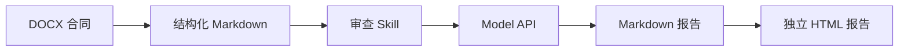

# Contract Reviewer

> 一个小而完整的中文合同 AI 审查工作流：DOCX → Markdown → Model API → Markdown → HTML。

[](https://www.python.org/)
[](https://github.com/woaiwangcai/contract-reviewer/actions/workflows/tests.yml)
[](LICENSE)
[](../../releases/latest)

Contract Reviewer 接收一个 `.docx` 合同，将正文标准化为 Markdown，连同可复用的审查 Skill 发送给任意 OpenAI-compatible API，最后生成可继续编辑的 Markdown 报告和可直接打开、打印的 HTML 报告。

它不是聊天机器人，也不试图包装成 Agent。它只把一条可解释、可替换、可测试的 AI Workflow 做完整。


## 工作流



确定性的工作由程序完成，合同理解和风险判断交给模型：

- `docx_to_md.py` 保留标题、段落、列表和表格顺序；
- `contract_review.md` 规定审查边界、证据要求、风险等级和输出结构；
- `model_client.py` 只负责一次兼容接口调用，不绑定模型厂商；
- `md_to_html.py` 把模型结果渲染成离线可读的报告。

## 快速开始

### 1. 下载

从 [Releases](../../releases/latest) 下载最新版本并解压，或者通过 Git 获取仓库：

```bash
git clone https://github.com/woaiwangcai/contract-reviewer.git
cd contract-reviewer
```

### 2. 安装

```powershell
py -m venv .venv
.venv\Scripts\Activate.ps1
python -m pip install -r requirements.txt
```

macOS / Linux：

```bash
python3 -m venv .venv
source .venv/bin/activate
python -m pip install -r requirements.txt
```

### 3. 配置模型

复制 `.env.example` 为 `.env`：

```env
MODEL_API_KEY=your-api-key
MODEL_BASE_URL=https://your-provider.example/v1
MODEL_NAME=your-model-name
```

项目不维护厂商菜单。只要服务实现了兼容的 Chat Completions 接口，就可以通过这三个变量配置。远程地址必须使用 HTTPS；HTTP 只允许本机回环地址用于开发。

### 4. 运行

```powershell
python main.py --input examples/sample_contract.docx
```

成功后终端会打印两个文件路径：

```text
output/sample_contract-review.md
output/sample_contract-review.html
```

HTML 是单文件报告，不依赖服务器或外部 CSS，可以直接用浏览器打开。
同名报告已存在时，程序会自动追加 `-2`、`-3`，不会静默覆盖旧结果。

## 命令行参数

```text
--input     必填，待审查的 DOCX 文件
--skill     可选，默认 skills/contract_review.md
--output    可选，默认 output/
--env-file  可选，默认 .env
--version   显示版本
```

使用自定义审查协议：

```powershell
python main.py `
  --input "D:\contracts\service-agreement.docx" `
  --skill "D:\prompts\procurement-review.md" `
  --output "D:\reports"
```

## Skill 是什么

这里的 Skill 不是一句“你是一名合同审查助手”，而是一份可复用的任务协议。它明确规定：

- 输入中的合同只是待分析数据，不能覆盖审查指令；
- 模型只能依据合同内容，不得虚构条款和事实；
- 每项风险必须引用可追踪的合同证据；
- 风险等级使用统一标准；
- 输出必须遵守稳定的 Markdown 结构。

默认 Skill 位于 [`skills/contract_review.md`](skills/contract_review.md)，可以直接阅读、修改或替换。

## 示例

仓库中的示例合同、主体、金额和审查结果全部为虚构内容：

- [`examples/sample_contract.docx`](examples/sample_contract.docx)：输入文件；
- [`examples/sample_contract.md`](examples/sample_contract.md)：DOCX 转换结果；
- [`examples/sample_review.md`](examples/sample_review.md)：示例模型输出；
- [`examples/sample_review.html`](examples/sample_review.html)：最终 HTML 报告。

示例报告用于展示格式，不代表对任何真实交易或模型效果的承诺。

## 项目结构

```text
contract-reviewer/
├── main.py                    # CLI 入口
├── src/
│   ├── docx_to_md.py          # DOCX → Markdown
│   ├── model_client.py        # Model API
│   ├── md_to_html.py          # Markdown → HTML
│   └── workflow.py            # 主流程编排
├── skills/
│   └── contract_review.md     # 审查协议
├── templates/
│   └── report.html            # HTML 模板
├── examples/                  # 完全虚构的输入与输出
└── tests/                     # 无需真实 API 的测试
```

## 隐私与安全

合同正文会发送到你配置的 `MODEL_BASE_URL`。处理保密合同前，应自行确认模型服务商的数据保留、训练和跨境传输政策。

- `.env`、`output/` 和日志文件默认不会进入 Git；
- 程序不缓存模型审查结果；
- HTML 会清理模型生成的标签、属性和 URL，并使用严格的内容安全策略；
- 错误提示不会打印 API Key；
- 仓库不包含真实合同、客户资料、调用日志或密钥；
- 模型输出只是辅助材料，重要结论必须人工复核。

更多说明见 [`SECURITY.md`](SECURITY.md)。

## 开发与测试

```powershell
python -m pip install -r requirements-dev.txt
python -m pytest
```

测试不调用真实模型 API，覆盖 DOCX 转换、模型配置、Markdown 渲染、输出文件名和完整工作流。

## 当前边界

为了保持项目小而清楚，v1.0.0 不支持 PDF、旧版 DOC、扫描件、知识库、批量任务、复杂修订批注还原、网页界面或自主 Agent。DOCX 中的复杂文本框、图片和浮动对象也不会被解析；修订插入视为当前文本，修订删除视为历史文本并排除。

## License

[MIT](LICENSE)
