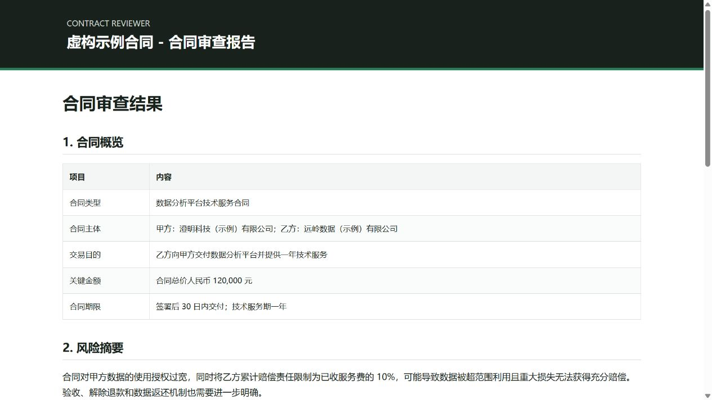
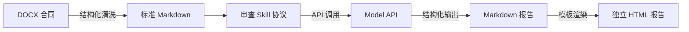

# Contract Reviewer ⚖️🤖

> **高可控、轻量级、零厂商绑定的中文合同 AI 审查工作流。**  
> 一键打通 `DOCX 结构化解析` → `协议约束审查` → `大模型深度研判` → `双格式报告自动生成`。

[](https://www.python.org/)
[](https://github.com/woaiwangcai/contract-reviewer/actions/workflows/tests.yml)
[](LICENSE)
[](../../releases/latest)

---

**Contract Reviewer** 专为追求**可靠性与审查深度**的法律科技场景设计。它将复杂格式的 DOCX 合同文件转化为标准结构化 Markdown，结合工业级审查协议（Skill），接入任意兼容标准接口的大模型，最终自动化交付可继续二次编辑的 Markdown 报告与**开箱即用、支持离线阅读和直接打印的单文件 HTML 报告**。



---

## 核心亮点

* **确定性工程管线**：格式转换、结构保真、报告渲染全部由代码确定性执行，模型仅聚焦风险识别与法理判断。
* **严格的数据与指令分离**：将合同全文视为纯只读输入，从机制上防御提示词注入，杜绝模型虚构条款。
* **证据链精准溯源**：审查报告强制要求每一项法律风险关联合同原文字句，杜绝空泛推论。
* **全平台模型兼容**：采用通用接口标准，无缝适配各类主流开源及商用大语言模型。
* **独立单文件报告**：HTML 报告内置完整样式与排版，零外部网络依赖，离线秒开且支持直接打印。

---

## 架构与工作流



### 模块分工

| 模块 | 文件 | 职责说明 |
| :--- | :--- | :--- |
| **文档解析** | `src/docx_to_md.py` | 严格保留标题层级、段落、列表与表格顺序，剔除冗余干扰样式 |
| **审查协议** | `skills/contract_review.md` | 明确审查边界、证据要求、风险等级标准与结构化输出格式 |
| **模型驱动** | `src/model_client.py` | 通用接口客户端，负责标准化调用与安全校验 |
| **报告渲染** | `src/md_to_html.py` | 执行内容安全清理，注入阅读样式，生成独立单文件 HTML 报告 |

---

## 快速开始

### 1. 下载

从 [Releases](../../releases/latest) 下载最新版本并解压，或通过 Git 获取仓库：

```bash
git clone https://github.com/woaiwangcai/contract-reviewer.git
cd contract-reviewer
```

### 2. 环境配置

**Windows (PowerShell):**
```powershell
py -m venv .venv
.venv\Scripts\Activate.ps1
python -m pip install -r requirements.txt
```

**macOS / Linux:**
```bash
python3 -m venv .venv
source .venv/bin/activate
python -m pip install -r requirements.txt
```

### 3. 配置模型参数

复制环境变量示例文件：

```bash
cp .env.example .env
```

在 `.env` 中配置你的模型服务参数：

```env
MODEL_API_KEY=your-api-key
MODEL_BASE_URL=https://your-provider.example/v1
MODEL_NAME=your-model-name
```

> 远程地址必须使用 HTTPS；HTTP 仅允许本机回环地址用于本地开发调试。

### 4. 运行审查

```bash
python main.py --input examples/sample_contract.docx
```

执行成功后，终端将输出生成的报告路径：

```text
output/sample_contract-review.md
output/sample_contract-review.html
```

* **防覆盖机制**：若同名报告已存在，程序会自动追加序号（如 `-2`、`-3`），保障历史记录安全。

---

## 命令行参数

```text
--input     必填，待审查的 DOCX 文件路径
--skill     可选，审查协议文件路径（默认 skills/contract_review.md）
--output    可选，报告输出目录（默认 output/）
--env-file  可选，环境变量文件路径（默认 .env）
--version   显示版本信息
```

使用自定义审查协议：

```bash
python main.py \
  --input "contracts/service-agreement.docx" \
  --skill "skills/procurement-review.md" \
  --output "reports"
```

---

## 审查协议（Skill）设计

这里的 Skill 是一份具备工业级约束的**审查执行标准与接口契约**，明确规定：

* **上下文隔离**：合同全文仅作为待分析数据，不可覆盖系统审查指令；
* **严禁虚构**：模型必须依据合同客观事实，不得臆造条款与背景；
* **证据追溯**：每项风险必须明确引用可追踪的合同原文作为佐证；
* **统一等级**：采用统一标准划分风险严重程度；
* **稳定输出**：强制遵循固定的 Markdown 层级结构，保障下游解析与渲染稳定性。

默认协议位于 [`skills/contract_review.md`](skills/contract_review.md)，支持直接修改或按业务定制。

---

## 示例文件

仓库内所有示例合同、主体、金额与审查结果均为虚构内容：

* [`examples/sample_contract.docx`](examples/sample_contract.docx)：测试输入合同
* [`examples/sample_contract.md`](examples/sample_contract.md)：结构化转换结果
* [`examples/sample_review.md`](examples/sample_review.md)：示例模型输出报告
* [`examples/sample_review.html`](examples/sample_review.html)：渲染后的独立 HTML 报告

---

## 项目结构

```text
contract-reviewer/
├── main.py                    # 命令行入口
├── src/
│   ├── docx_to_md.py          # DOCX → Markdown 结构化解析
│   ├── model_client.py        # 模型 API 接口适配
│   ├── md_to_html.py          # Markdown → HTML 独立渲染
│   └── workflow.py            # 工作流主调度器
├── skills/
│   └── contract_review.md     # 默认审查协议
├── templates/
│   └── report.html            # 独立 HTML 报告模板
├── examples/                  # 虚构示例文件
└── tests/                     # 自动化测试套件
```

---

## 隐私与安全

合同正文将发送至所配置的 `MODEL_BASE_URL`。处理保密合同前，请确认所选模型服务商的数据隐私与合规政策。

* `.env`、`output/` 与日志文件默认已列入忽略名单，不会提交至代码仓库；
* 程序本身不设任何云端中转，不收集任何用户数据；
* HTML 渲染内置严格的内容安全策略，自动清洗潜在危险标签与属性；
* 错误提示自动对密钥等敏感凭证进行脱敏处理；
* AI 审查结果仅供专业辅助参考，重要法律事务请结合人工复核。

---

## 开发与测试

运行内置测试套件（测试环节无需调用真实 API，不产生额外调用费用）：

```bash
python -m pip install -r requirements-dev.txt
python -m pytest
```

---

## 开源协议

本项目基于 [MIT](LICENSE) 协议开源。
